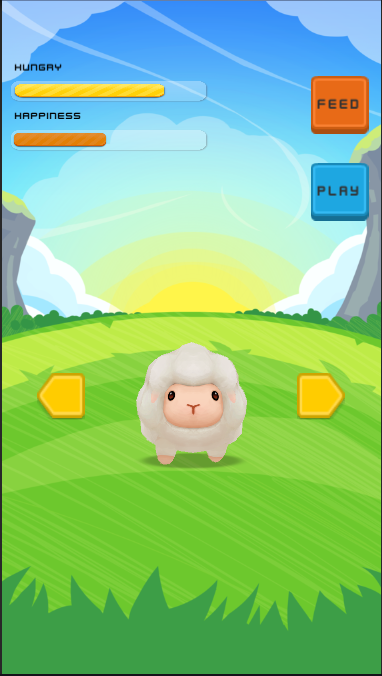
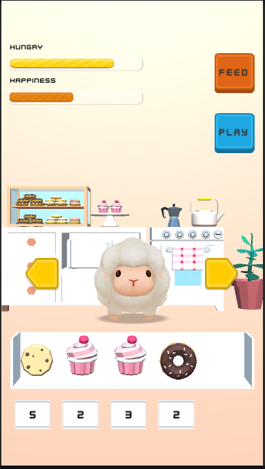
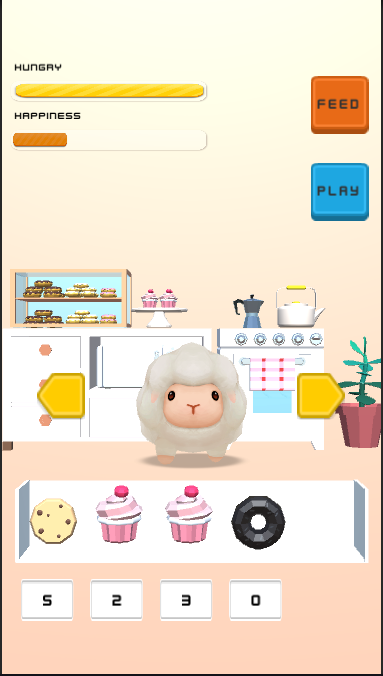
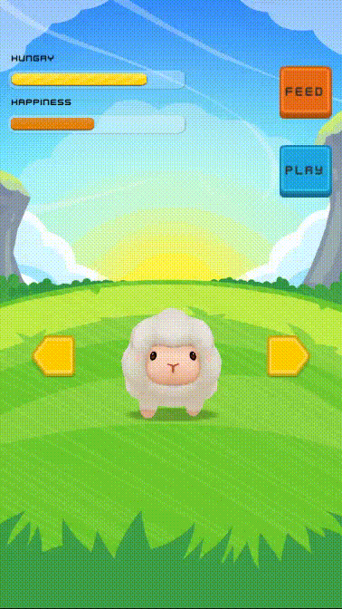

<h1 align="center">PetCare Project  </h1>  

This is a game were it's possible to feed and play with the choosed Pet, this is inspired by the MyBoo2 Game from Tapps Games and Pou from Zakeh Ltd in the google play store.

The ideia was to create a simple prototype to review and learn new things from Unity and game development, in order to achieve and reinforce developer habilities.

<h2 align="center">Project Images </h2>

    
  
  
  

 
<h2 align="center">Implemented Features</h2> 

### Foods
* Pet can eat different foods to increase it hungry.
* Pet can access the kitchen that has a basket with different food types.
* Pet can't eat if it's hungry bar is full.
* Pet decrease it's hungry by the passing time while the game is open.

### Mechanics
* Pet rotation.
* Current rooms: backyard and kitchen.

<h2 align="center">Detailed Implemented Features</h2> 

1. The Kitchen and BasketController receives and Manage the items that the pet will be able to consume during the game.

2. The BasketController receives the kitchen items and instantiate them inside the basket game object using a preview configuration.

3. The basket has a counter that shows up the current number of each item inside the basket that the pet can consume, and changes when an item has been consumed.

4. Created a small system to decrease the pet hungry and happiness after a amount of time set into the game.

5. The pet can't consume items when it's hungry bar is full, the item will become black and it's not possible to select it.

6. The pet can't decrease status when each bar are empty.

7. Created a PetController that manage the instantiation and inject PetData to build the setted pet.

<h2 align="center">To do</h2> 

1. Pet will be able to change rooms, going to the kitchen, backyard or the bedroom
    * In the backyard will be possible to Play a ballon game to gain points and restaure pet happiness
    * In the bedroom pet will be able to rest and restaure status

2. Ballon Game to gain points
    * Pop up the right ballons to receive points
    * Pop up wrong ballons to game over
    * Score system to manage pet game points

3. Choose Pet screen after beggining the game
    * User will be able to choose between 3 types of pets(just diferentiate the model) Penguin, Cat and the currently sheep.

<h2 align="center">Free Assets used</h2> 

coffeeshop-starter-pack: 
* https://assetstore.unity.com/packages/3d/props/coffeeshop-starter-pack-160914

lovely-animals-pack: 
* https://assetstore.unity.com/packages/3d/characters/animals/lovely-animals-pack-92629

ute-gui-pack-lite: 
* https://assetstore.unity.com/packages/2d/gui/icons/cute-gui-pack-lite-202389

Kenney ui-pack: 
* https://www.kenney.nl/assets/ui-pack

POLYCRAFT - Christmas Tree:
* https://assetstore.unity.com/packages/3d/vegetation/trees/polycraft-christmas-tree-108277

